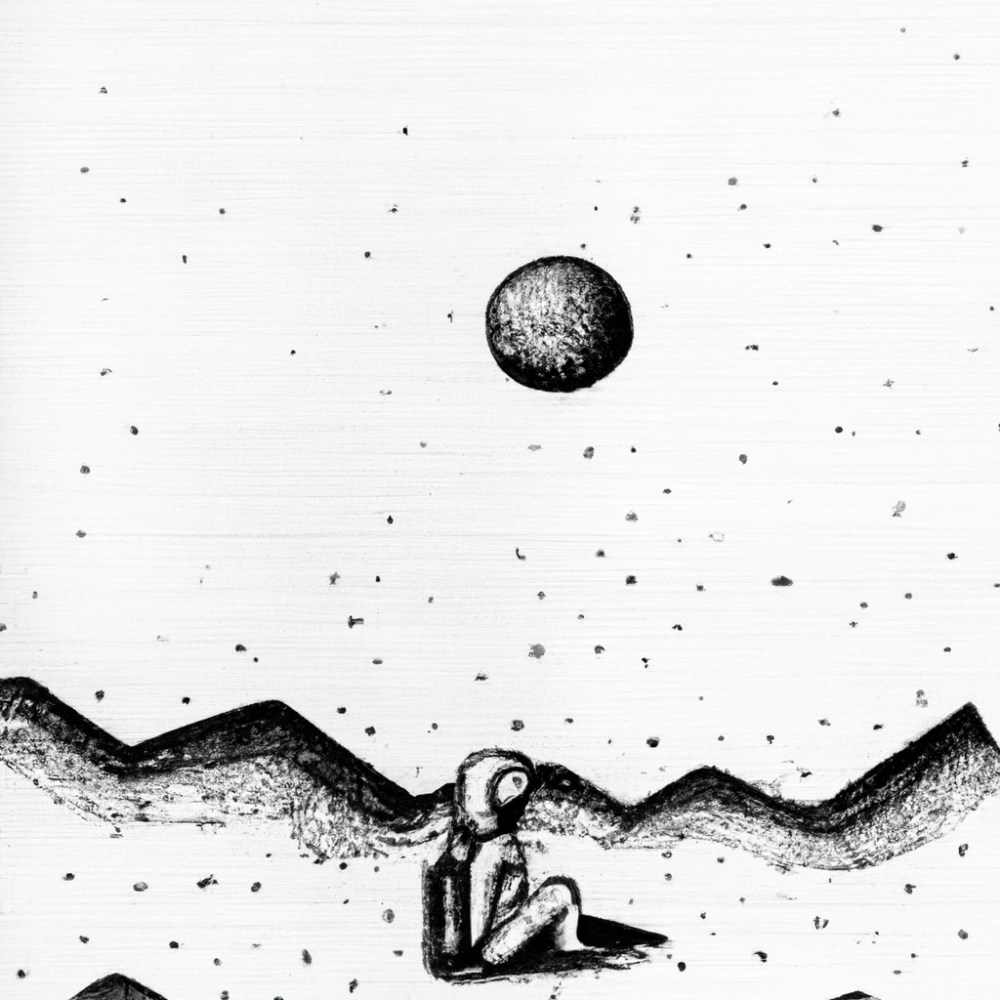

# Modularity [Table of Contents]

| id  | title & content | method | notes | img(s) |
| --- | --------------- | ------ | ----- | ------ |
| 001 | [user](./work001.txt)  | Permuations (nick monfort)| + comments | ;  | 
| 002 | [folkenroth](./work002.txt) | ^^ | | 
; |
| 003 | [first words \\ first code](./work003.txt) | ChatGPT browser + RiTa phonetics | prompts: `list of 20 babies first words`, `list of 20 words first graders have difficulty spelling`, `list of 20 of the first Spanish words an English speaker would learn`, `list of ten of the most misspelled words in English` | | 
| 004 | [hh-ah-l-ow w-er-l-d](./work004.txt) | RiTa phonetics | |  |
| 005 | [stair-well](./work005.md) | whisperAPI | | |
| 006 | [who are you?](./work006.txt) | ChatGPT local persona | |  |
| 007 | [where am i](./work007.md) | ChatGPT browser & Google Search Engine | prompts: `can you append words to the end of "where am I" for a browser search`, `can you be poetic and existential with new suggestions`| |
| 008 | [who am i](./work008.txt) | ChatGPT local persona | |  |