# NaPoGenMo 2023: Project Plan

## Summary

I am planning to generate a poetic memoir. This will be a deliverable of both a website with the prompts that are regenerated upon retrieval and the pdf version that captures a run of the website (for word count and artifact purposes). I am looking to explore themes of youth, growing up, legacy, nostalgia, and transitions in to a new life. I want to do this by using various methods for self expression correlated with the theme of the chapter (e.g. permutations or phonetic with youth, chat completion for discussing the unknown future).

### Tentative Title

 _UX_

### Progress Report 4.14.2023

Progress has been satisfactory to this point in time. The pieces I have created and compiled so far are ready to be presented. I may still reorganize these pieces as I add more. I am having difficulties just with having time and internet access to code at the moment from travel. However, I have been planning and writing down items to work with to create more pieces. I am concerned about achieving the word count but am excited to still attempt to achieve this bar and not needing to count pictures. It has been enjoyable to follow my interests and be able to follow the sparks of creativity. The multiple shorter pieces really captured what I've been intending to present. I need to pursue larger bodies or sections of work like stairwell and my use of the whisper API. My concept has solidified into its memoir state and spoken more to my experience to this point in my life while exercising some strong posthumanism motifs.

# Goals & Aspirations

I would like to design it around the themes and rooted in technological words.Starting with ChatGPT, I collected a series of words/terms to guide my creative process. I will make each piece separately then curate into a single pdf.

I have derived aesthetic and content ideas from the following sources:

## Page Layout Inspiration

* _Shel Silverstein_
    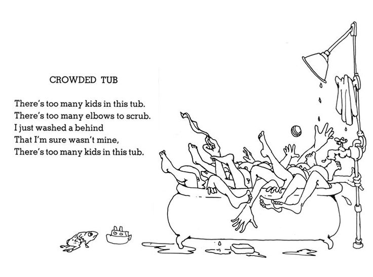
    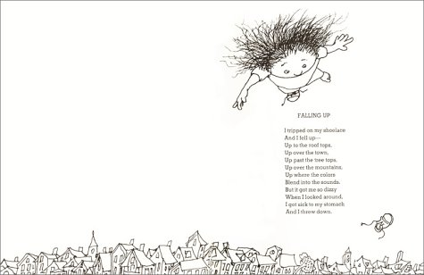

* _Jonny Sun_
    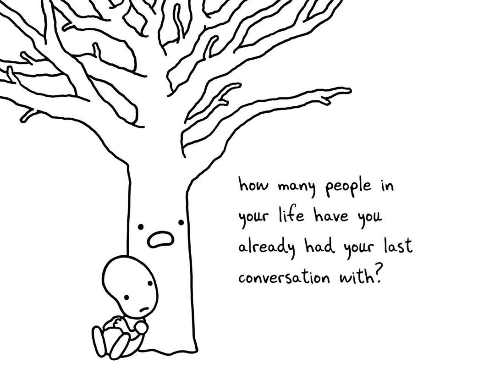
    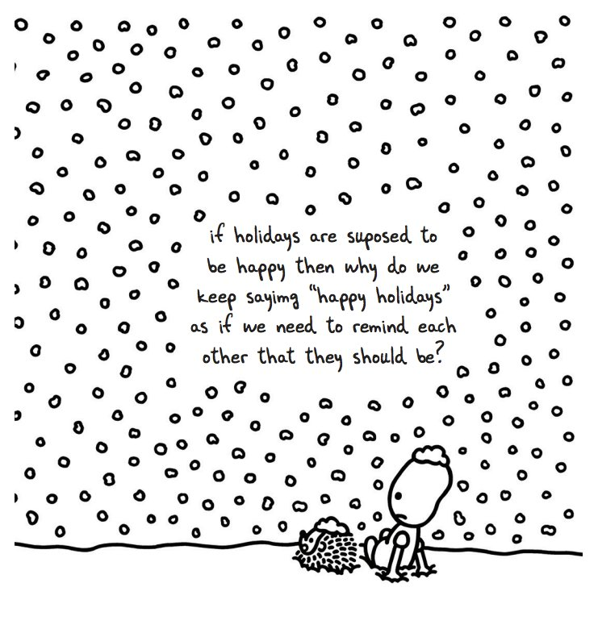
    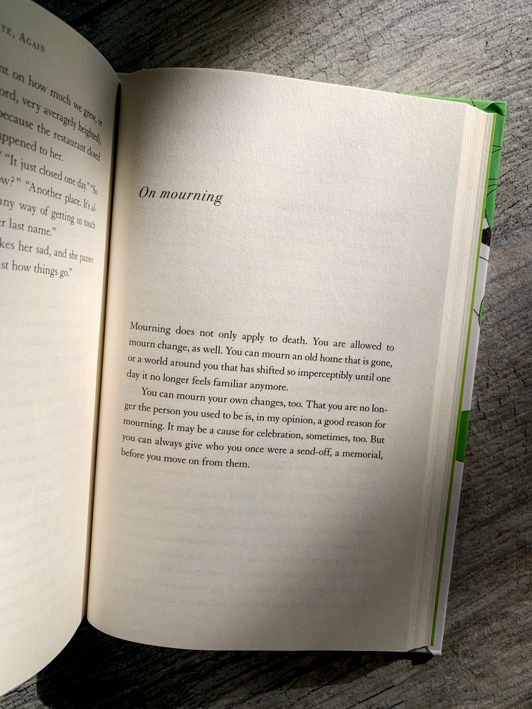
    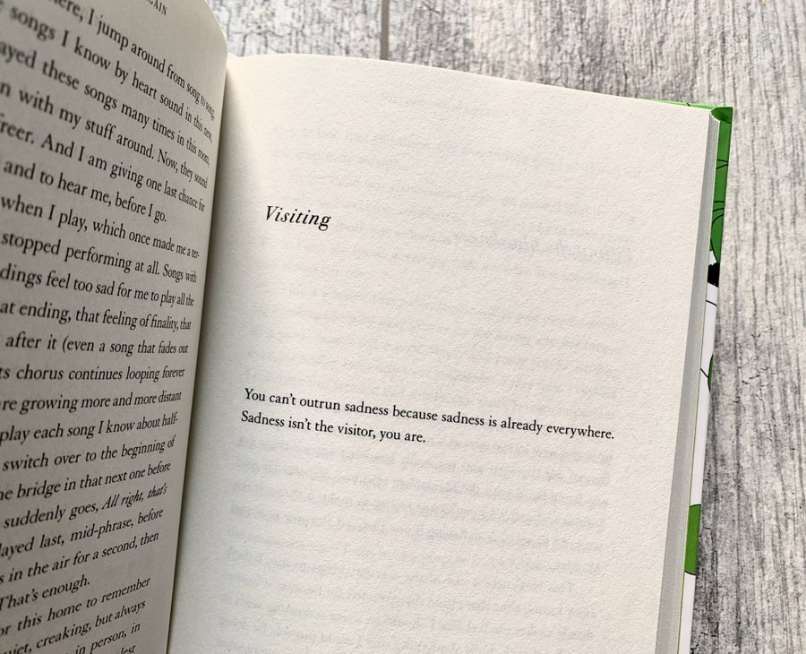

* `Oranges`
    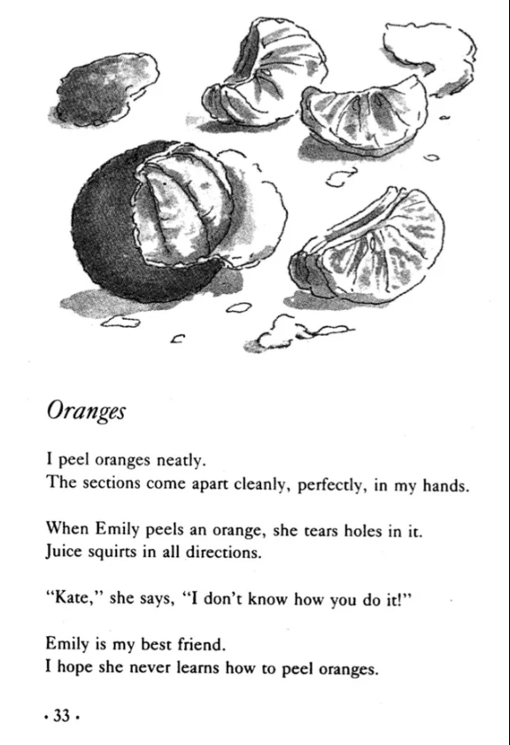

## Internet Inspiration

* World Wide Web
    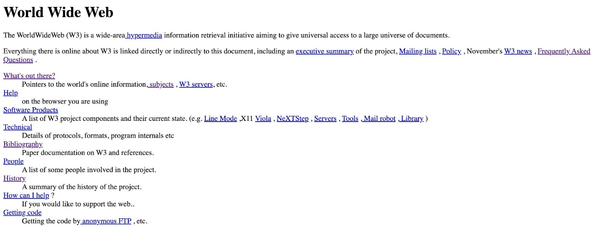

* Zoe White comping in the ALIC
    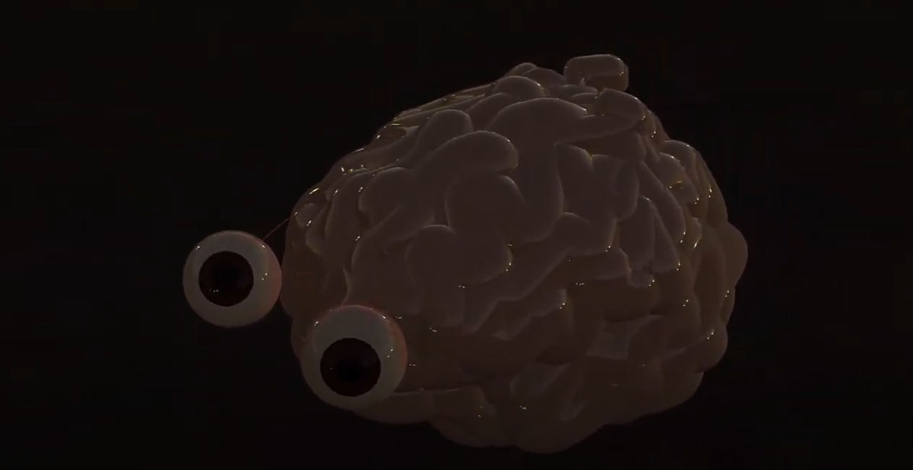

## Content Guidance

* _Susan Howe_
    - `[that-this](https://www.writing.upenn.edu/epc/authors/howe/that-this.html)`
    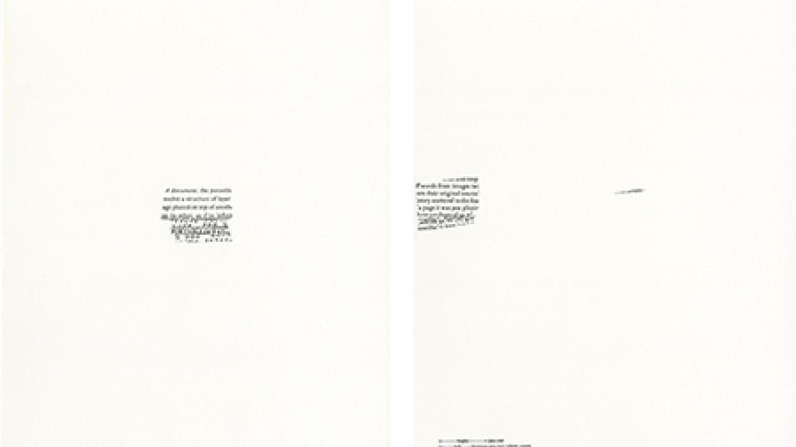
    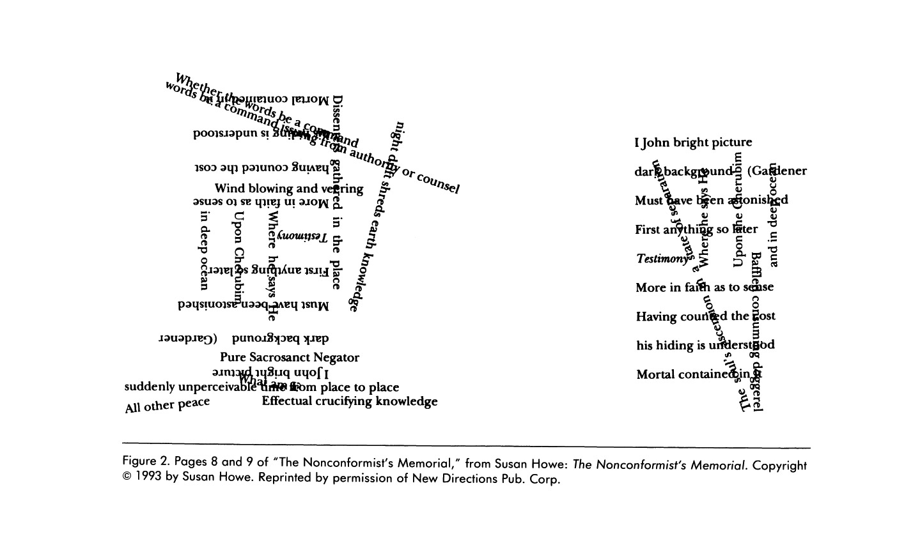

* _Douglas Kearney_
    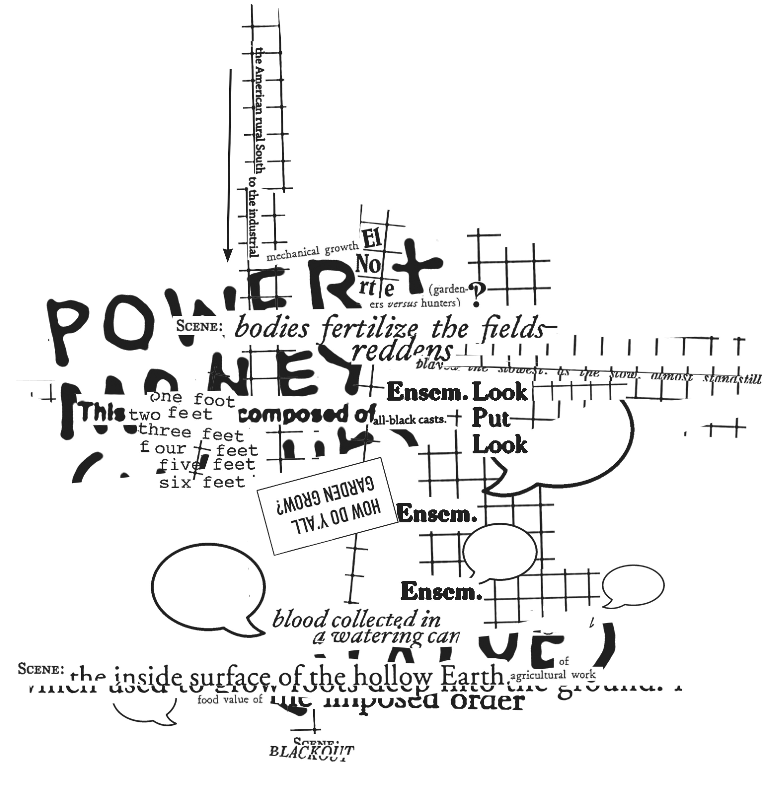
    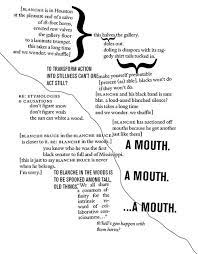

* _Charles O. Hartman_
    - [Virtual Muse: experiments in computer poetry](./inspiration/Wesleyan_Poetry_Virtual_Muse_Experiments_in_Computer_Poetry.pdf)

* _John Cage_
    - 4'33"

### In conversation with:

1. _`#!` - Nick Montfort_
    
    I appreciate Montfort's use different page background colors with input versus output. This work is also laid out in sections based on the styles exhibited in the works. Montfort has many examples of code that I would be interested in remixing and correlating with my own work. Most of these may be used in my "sandbox" section focused on youth. I think that the pieces "Round" (pgs 2-9), the combinatorics methods of "Taroko Gorge"(pgs 10-17), and the permutations seen in "I AM THAT I AM" (pgs 18-19).

2. _`Travesty Generator` - Lillian-Yvonne Bertram_

    In `Travesty Generator`, I am inspired to use code comments to connect the code even more into the output and product of generative work. This is seen especially in the work "three_last_words" (pgs 11-17). I also like their approach to labelling and presenting all of the iterations of the outputs from an input. This occurs in "Counternarratives" (pgs 18-31), "Husband Stories" (pgs 33-34), "@Tubman's_Rock" (pgs 41-51), "Coming of Age Stories" (pgs 57-59), "Incident" (pgs 60-69). The documentary elements of creating generative poems such as the recording of local time and ^C as see in "@Code_Switching" (pgs 35-38).One specific style I am looking at is the piece "A NEW SERMON ON THE WARPLAND" (pgs 54-56) which is a specific implementation of slotted poetry. 

3. _`Technelegy` - Sasha Stiles_

    This book is here for the content Stiles focuses on. Their work incorporating post-humanism and computer language while speaking towards the truth and core of the human condition are inspiring for my own. I picked out the pieces "Anthropocene Epic"(28-29), "Discontent Creators" (34), "Legacy"(37), "Imitations of Immortality"(76-77), "Portrait of the Poet as a Brief History of Humanity"(137). The chapter setup is also very parallel to what I desire. I also appreciate their use of emphasis, italics and bold, to represent the difference between prompts and output.


    ```ANTHROPOCENE EPIC (28-29)
    ANTHROPOCENE EPIC (28-29)

        Ode to ourselves.
        Age of humans in god mode,

        ego-conscious, myopic.
        We the force of nature.

        We the great acceleration, 
        atomic generation, primer

        with an evolutionary instinct
        for innovation. We make the plant

        our personal palimpsest: revise forests,
        edit oceans, print carbon data,

        era of epiphany and error
        errata written in rock strata.

        We breathe concrete particles,
        inscribe nitrogen and phosphorous in soils.

        We sculpt islands from tash, 
        our future ruins, the looming past.

        Pages of seafloor tell plastic stories,
        tales of radioisotopic rain,

        what we've rinsed down the drain.
        It is a wash, humanity?

        Is this legacy vanity?
        Time makes tragic geologic events

        of us all – Holocene,
        Anthropocene, Novacene

        never seen again… 
        In the end, does it matter

        how we spend our resources
        or our days? Consider:

        billions of dinosaurs
        roamed and roamed,

        then disappeared,
        except for a few teeth and bones.

        Consider the cosmic calendar.
        The universe has enough to remember.

        At this rate, in another epoch or two
        earthlings may be gone. 

        But maybe we'll live on and on 
        into the Sapiezoic Eon,

        electronically transformed,
        our technology's Cambrian explosion.

        Or learn to co-exist
        on a globe of biodesigned to perfection.

        Or start a whole new world when,
        at last, we're done with this one.
    ```

    ```DISCONTENT CREATORS (34)
    DISCONTENT CREATORS (34)

    I wonder if they named it feed
    knowing that we'd be ravenous

    and tame, gathering round 
    to eat out of their hands.

    ```

    ```LEGACY (37)
    LEGACY (37)

        What will humans look like in a hundred thousand years?

        Our deep descendants
        will be nothing like us,

        think nothing like us.
        They won't have our eyes

        or nose or hair or wisdom
        teeth, our love of books,

        our languishing language,
        DNA spelled the same way.

        Not our thin, frail skin,
        hot temper, tendency to sneeze

        in sunshine. But they'll have
        our sun, this same sun,

        under which nothing 
        and everything changes.

        Hearts that beat with our 
        old blood, swarming

        with ting bots made by us,
        gifted to the future.

        And when they bleed
        it won't mean the end,

        for they will live a long,
        long time, maybe forever,

        turning over these symbols, 
        sifting distant echoes of their 

        mothers, fathers, creators.
        They'll be so beautiful,

        like any children – 
        such familiar strangers.
    ```

    ```IMITATIONS OF IMMORTALITY (76-77)
    IMITATIONS OF IMMORTALITY (76-77)
        Because I take too many photos, my phone is always full.
        Stay in the moment, I tell myself.
        Now's not what it used to be.

        /

        The great tragedy is that we come and go at different times, staggered through life.
        How rarely we are here, wired to move through the world reaching.

        /

        My phone. My phone. I tend to it like a live thing.
        Stroke its face, cradle its warmth against my skin.
        Bare my soul, gaze into its wide eye.
        It listens and learns to be just like me.

        /

        What exactly is The Cloud, and where?
        If I store my self there, can I get it back?
        Is this it – the death of death?
        I haven't made up my mindfile yet.

        /

        When I lost my phone, I thought I'd die.
        Then I lost you.
        These days it's so easy to lose oneself in longing.
        What's on my mind?
        They want to win you back from afar…
        But I'm trapped, locked up in my avatar.

        /

        My body. My body's been leaving forever.
        My macrophages embrace danger.
        Immeasurable cellular departure.
        Matrix of deletion, my bad sector.

        /

        What's gone is gone.
        is gone.

        /

        I've got that strange feeling again.
        Desperate to save, and be saved.
        Are you prepared for data loss?
        Best go on believing.
    ```

    ```PORTRAIT OF THE POET AS A BRIEF HISTORY OF HUMANITY (137)
    PORTRAIT OF THE POET AS A BRIEF HISTORY OF HUMANITY (137)

        Yes, I was soft once,
        and so short-lived it's hard
        to think I ever wasted time

        fighting or wanting
        or holding my breath.
        I cared about flesh,

        brief carbon coalescence,
        believe I could coax
        more beauty from it.

        As though it wasn't 
        miracle enough. I 
        didn't care enough.

        When I was young ,
        warm with blood,
        I squandered myself,

        content to feel
        alive. I was billions
        of hearts beating

        out of sync. I was 
        all the cells in my body.
        I waited, terribly alone,

        nostalgic for a future 
        that came for me
        with a hum like hop

        and a taste of silver.
        Who could have dreamed
        how little I'd matter,

        except as proof
        of love? Could I 
        have done better?
    ```