# Inspiration list

## Page Vibes

* _Shel Silverstein_
    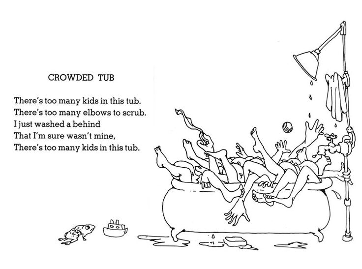
    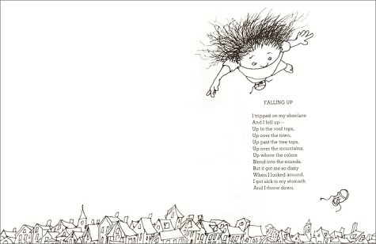

* _Jonny Sun_
    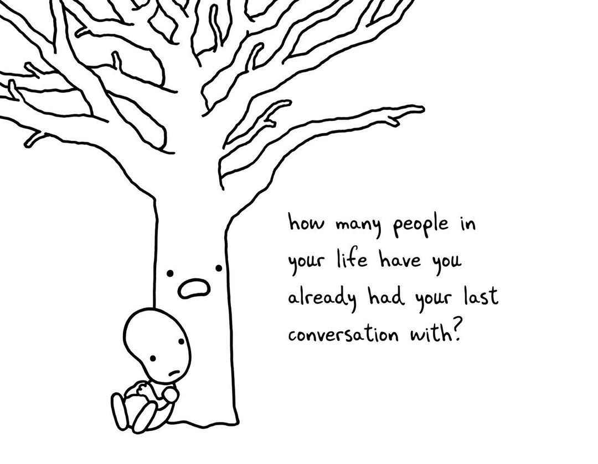
    
    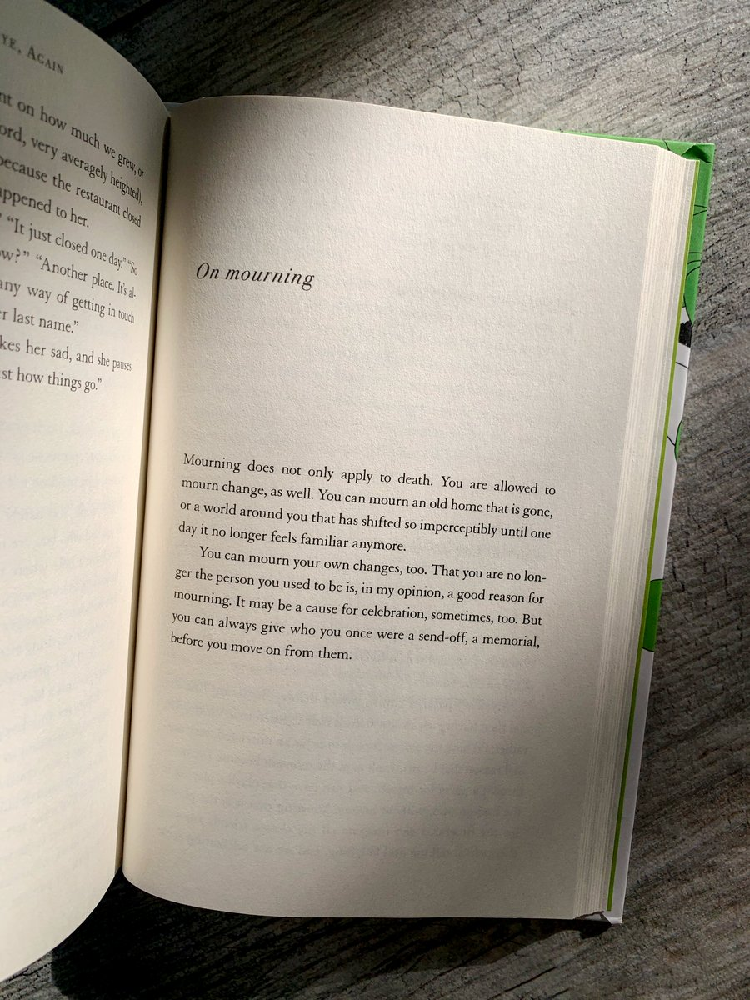
    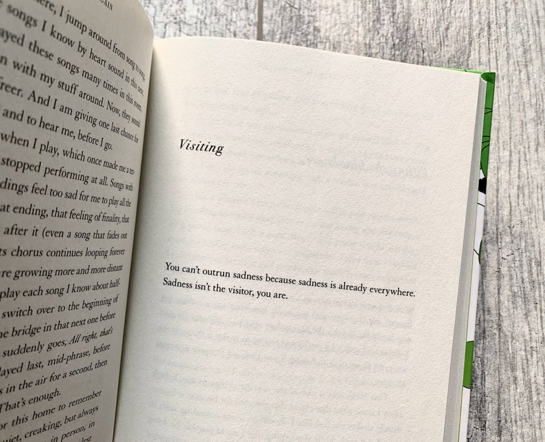

* `Oranges`
    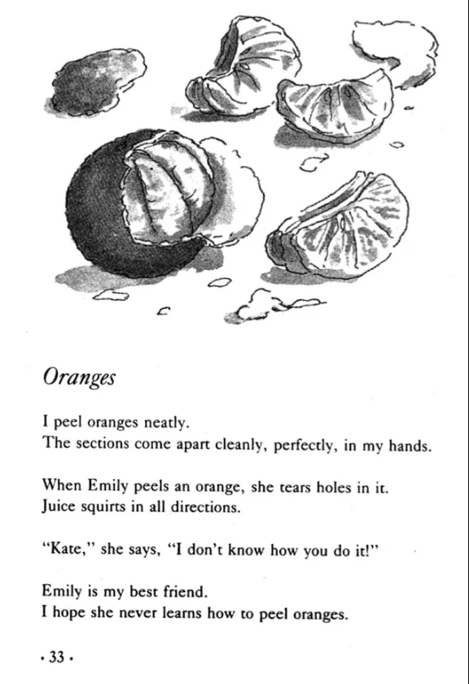

## Internet Inspiration

* World Wide Web
    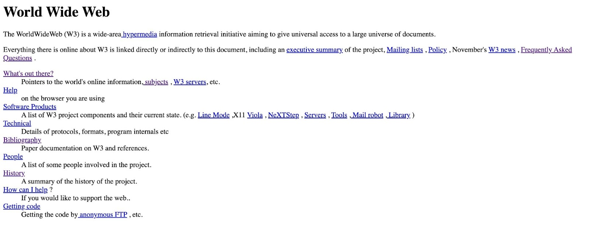

* Zoe White comping in the ALIC
    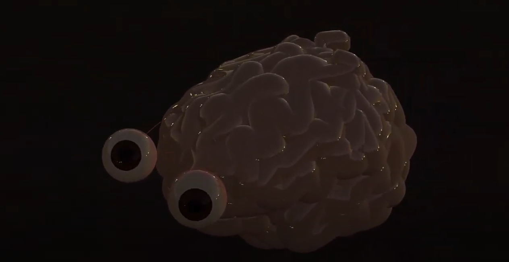

## Content Guidance

* _Susan Howe_
    - `[that-this](https://www.writing.upenn.edu/epc/authors/howe/that-this.html)`
    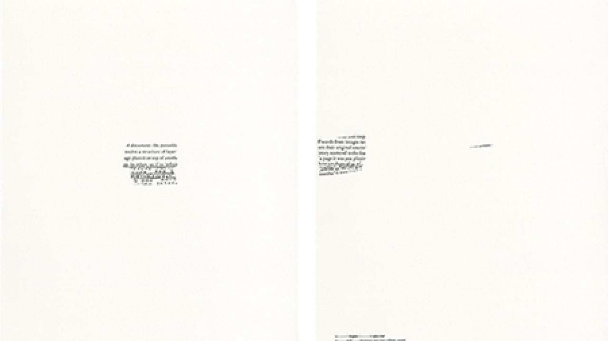
    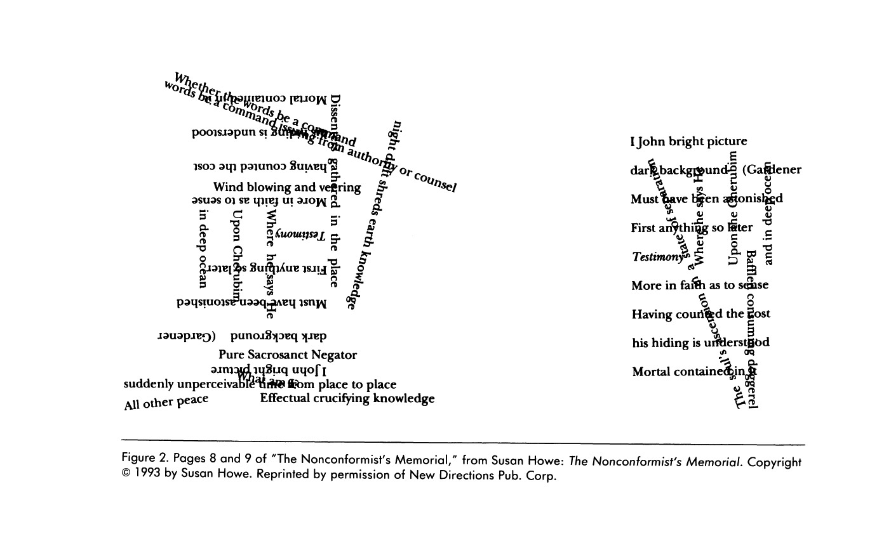

* _Douglas Kearney_
    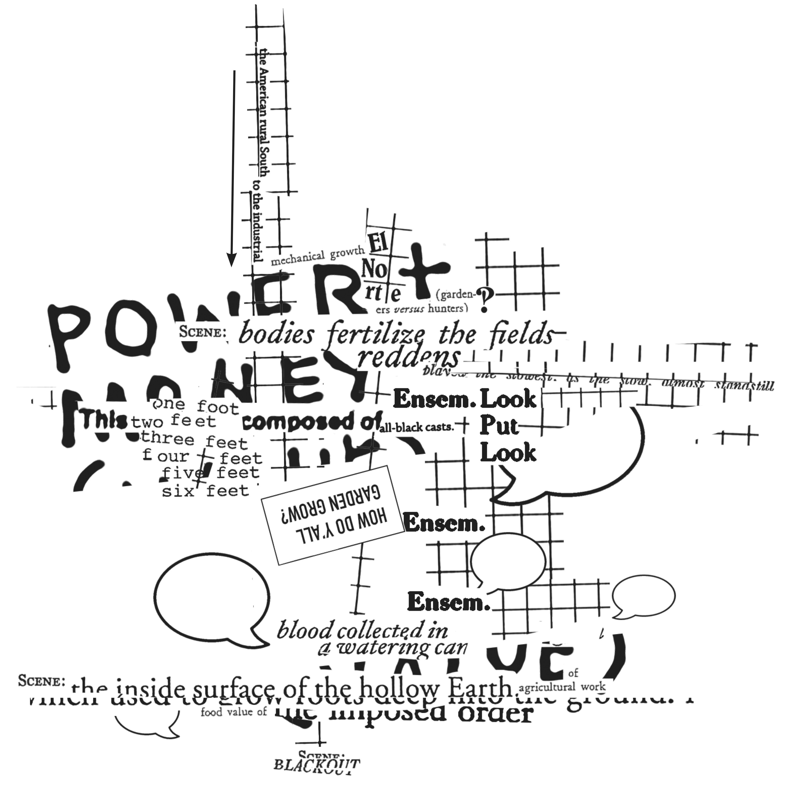
    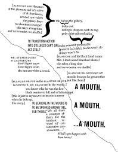

* _Charles O. Hartman_
    - [Virtual Muse: experiments in computer poetry](./inspiration/Wesleyan_Poetry_Virtual_Muse_Experiments_in_Computer_Poetry.pdf)

### CLASS BOOKS
* Lillian-Yvonne Bertram
    - `Travesty Generator`

* Nick Monfort
    - `#!`

* Sasha Stiles
    - `Technelegy`

    ```ANTHROPOCENE EPIC (28-29)
    ANTHROPOCENE EPIC (28-29)

        Ode to ourselves.
        Age of humans in god mode,

        ego-conscious, myopic.
        We the force of nature.

        We the great acceleration, 
        atomic generation, primer

        with an evolutionary instinct
        for innovation. We make the plant

        our personal palimpsest: revise forests,
        edit oceans, print carbon data,

        era of epiphany and error
        errata written in rock strata.

        We breathe concrete particles,
        inscribe nitrogen and phosphorous in soils.

        We sculpt islands from tash, 
        our future ruins, the looming past.

        Pages of seafloor tell plastic stories,
        tales of radioisotopic rain,

        what we've rinsed down the drain.
        It is a wash, humanity?

        Is this legacy vanity?
        Time makes tragic geologic events

        of us all – Holocene,
        Anthropocene, Novacene

        never seen again… 
        In the end, does it matter

        how we spend our resources
        or our days? Consider:

        billions of dinosaurs
        roamed and roamed,

        then disappeared,
        except for a few teeth and bones.

        Consider the cosmic calendar.
        The universe has enough to remember.

        At this rate, in another epoch or two
        earthlings may be gone. 

        But maybe we'll live on and on 
        into the Sapiezoic Eon,

        electronically transformed,
        our technology's Cambrian explosion.

        Or learn to co-exist
        on a globe of biodesigned to perfection.

        Or start a whole new world when,
        at last, we're done with this one.
    ```

    ```DISCONTENT CREATORS (34)
    DISCONTENT CREATORS (34)

    I wonder if they named it feed
    knowing that we'd be ravenous

    and tame, gathering round 
    to eat out of their hands.

    ```

    ```LEGACY (37)
    LEGACY (37)

        What will humans look like in a hundred thousand years?

        Our deep descendants
        will be nothing like us,

        think nothing like us.
        They won't have our eyes

        or nose or hair or wisdom
        teeth, our love of books,

        our languishing language,
        DNA spelled the same way.

        Not our thin, frail skin,
        hot temper, tendency to sneeze

        in sunshine. But they'll have
        our sun, this same sun,

        under which nothing 
        and everything changes.

        Hearts that beat with our 
        old blood, swarming

        with ting bots made by us,
        gifted to the future.

        And when they bleed
        it won't mean the end,

        for they will live a long,
        long time, maybe forever,

        turning over these symbols, 
        sifting distant echoes of their 

        mothers, fathers, creators.
        They'll be so beautiful,

        like any children – 
        such familiar strangers.
    ```

    ```IMITATIONS OF IMMORTALITY (76-77)
    IMITATIONS OF IMMORTALITY (76-77)
        Because I take too many photos, my phone is always full.
        Stay in the moment, I tell myself.
        Now's not what it used to be.

        /

        The great tragedy is that we come and go at different times, staggered through life.
        How rarely we are here, wired to move through the world reaching.

        /

        My phone. My phone. I tend to it like a live thing.
        Stroke its face, cradle its warmth against my skin.
        Bare my soul, gaze into its wide eye.
        It listens and learns to be just like me.

        /

        What exactly is The Cloud, and where?
        If I store my self there, can I get it back?
        Is this it – the death of death?
        I haven't made up my mindfile yet.

        /

        When I lost my phone, I thought I'd die.
        Then I lost you.
        These days it's so easy to lose oneself in longing.
        What's on my mind?
        They want to win you back from afar…
        But I'm trapped, locked up in my avatar.

        /

        My body. My body's been leaving forever.
        My macrophages embrace danger.
        Immeasurable cellular departure.
        Matrix of deletion, my bad sector.

        /

        What's gone is gone.
        is gone.

        /

        I've got that strange feeling again.
        Desperate to save, and be saved.
        Are you prepared for data loss?
        Best go on believing.
    ```

    ```PORTRAIT OF THE POET AS A BRIEF HISTORY OF HUMANITY (137)
    PORTRAIT OF THE POET AS A BRIEF HISTORY OF HUMANITY (137)

        Yes, I was soft once,
        and so short-lived it's hard
        to think I ever wasted time

        fighting or wanting
        or holding my breath.
        I cared about flesh,

        brief carbon coalescence,
        believe I could coax
        more beauty from it.

        As though it wasn't 
        miracle enough. I 
        didn't care enough.

        When I was young ,
        warm with blood,
        I squandered myself,

        content to feel
        alive. I was billions
        of hearts beating

        out of sync. I was 
        all the cells in my body.
        I waited, terribly alone,

        nostalgic for a future 
        that came for me
        with a hum like hop

        and a taste of silver.
        Who could have dreamed
        how little I'd matter,

        except as proof
        of love? Could I 
        have done better?
    ```

    


